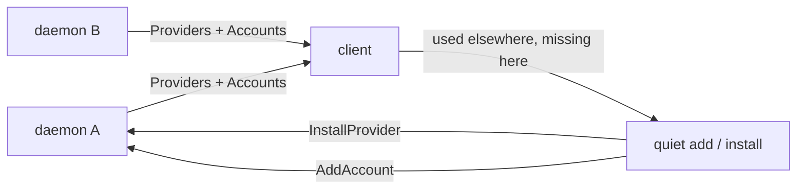

<!-- a084fb9b-a5dd-4875-90a0-ba08382c111a -->
---
todos:
  - id: "contract"
    content: "Add ProviderStatus, Providers snapshot, and InstallProvider to herder-protocol; bump schemas and protocol tests"
    status: pending
  - id: "daemon"
    content: "Probe runnable CLIs, run owner-only install/update in a login-style terminal, push Providers after hello and on change"
    status: pending
  - id: "client-core"
    content: "Expose Machine.providers, install_provider, and a shared model/provider catalog via FFI"
    status: pending
  - id: "tui"
    content: "Accounts: quiet used-elsewhere / version lines; provider-first add dialog; catalog models in the switch picker"
    status: pending
  - id: "apple"
    content: "Same hints and add-sheet; fill Cursor/OpenCode in ModelCatalog"
    status: pending
isProject: true
---
# Provider management

## What’s wrong today

Provider setup is three unconnected lists, none of which know about the others:

- **Add account** is a form. The TUI cycles only Claude / Codex / Cursor in [`crates/herder-tui/src/accounts.rs`](crates/herder-tui/src/accounts.rs). Apple chips Claude / Codex / Cursor / OpenCode in [`apple/HerderKit/Sources/HerderKit/AccountSettings.swift`](apple/HerderKit/Sources/HerderKit/AccountSettings.swift). Grok can run sessions but cannot be added. Gemini is a wire name only ([`crates/herder-daemon/src/accounts.rs`](crates/herder-daemon/src/accounts.rs) has no adapter).
- **Model pickers** are a static Apple catalog. Claude, Codex, and Grok have names; Cursor / Gemini / OpenCode fall through to a single “default” row ([`apple/HerderKit/Sources/HerderKit/ModelCatalog.swift`](apple/HerderKit/Sources/HerderKit/ModelCatalog.swift)). The TUI switch dialog is free text plus three recent models ([`crates/herder-tui/src/switch.rs`](crates/herder-tui/src/switch.rs)).
- **CLI health** exists only in `herder doctor` (`--version` / not on PATH). Clients never see it, so there is no update affordance and no install.

herder does **not** store a login email. Codex fixtures have one and we redact it; Claude usage is plan windows, not identity. The useful “same person, other machine” signal is already on the client: which **providers have accounts on the other machines you own**. Use that. Do not add email to [`Account`](crates/herder-protocol/src/server.rs) (identity, extra contract, Claude-shaped).

## Design

**Quiet, not a storefront.** Never list every known vendor. A machine only hints about providers that already have an account on another connected machine you own. A laptop without Cursor is fine if no machine has Cursor.

Per machine, after its accounts:

- `also on laptop: cursor` — this host has no Cursor account. One action starts add (and install first if the CLI is missing).
- `cursor 0.x · update` — CLI present; another of your machines reports a newer `--version`, or the vendor has a dedicated update (`agent update`). One action opens the same style of terminal as login.

Keep this to one muted line per gap. No banners, no “you should install Gemini”.

**Add account becomes provider-first.** Pick a runnable provider (Claude, Codex, Cursor, OpenCode, Grok once login exists). Show install state and “used on laptop” on the row. Auto-id `cursor` / `cursor-2`. Label optional. Config dir stays optional/advanced. If the CLI is missing, Install then Log in — same terminal pattern as [`AddAccount`](crates/herder-protocol/src/client.rs).

**Model lists share one catalog.** Cursor should offer Auto / Composer 2.5 / a short named set, not one empty default. OpenCode and Grok get the same treatment they already have on Apple. The TUI switch footer lists those names as picks, not only recents. “Other…” / free text stays.

**Install is never silent.** Owner-only, on that machine, in a relayed terminal — same trust model as login. The daemon runs the vendor’s documented installer or updater (`agent update`, official curl/npm scripts). If this OS has no recipe, show the command and refuse one-click. herder still never reads the config dir.

## Contract (required)

This is a `[CONTRACT]` change: protocol, store is untouched, adapter trait untouched, client-core public API grows.

In [`crates/herder-protocol`](crates/herder-protocol):

- `ProviderStatus`: `provider`, `installed`, `version` (from `--version` when it runs), `binary`, `can_install`, `can_update`.
- `ServerMessage::Providers { providers }` after hello and whenever the set changes (install finished, binary appeared).
- `CommandBody::InstallProvider { provider, cols, rows }` — owners only, opens a terminal like `add_account`. Reuse `TerminalPurpose::Login` or add `Install { provider }` so the UI can title it.

Daemon ([`crates/herder-daemon`](crates/herder-daemon), next to [`login.rs`](crates/herder-daemon/src/login.rs) and [`doctor.rs`](crates/herder/src/doctor.rs)):

- Probe the five runnable providers on a timer and after install (same `--version` doctor already runs).
- Install/update recipes live beside login programs. Cursor: `agent update` when installed, else the official `agent` installer. Others: documented vendor install, which is also the update.
- `can_install` is false when there is no recipe for this OS.

[`herder-client-core`](crates/herder-client-core): `Machine.providers`, `Client::install_provider`, and a small **shared catalog** (display name, default model, named models) so Apple and the TUI stop drifting. FFI exposes it. `CLIENT_API_VERSION` bumps.

Do **not** add Gemini to add-account. It cannot run sessions.

Grok: sessions work; add login to [`login::programs`](crates/herder-daemon/src/login.rs) only if the CLI has a non-localhost device flow. Otherwise show it in the picker as “configure on the machine” and still hint when another host has it.

## Client work

**TUI** — [`crates/herder-tui/src/views/accounts.rs`](crates/herder-tui/src/views/accounts.rs), [`accounts.rs`](crates/herder-tui/src/accounts.rs), [`views/switch.rs`](crates/herder-tui/src/views/switch.rs):

- Machine block: accounts, then the quiet “also on …” / version line.
- Add dialog: provider list with status, then id (prefilled), optional label; config dir collapsed.
- Switch: catalog models for the selected account’s provider under the model field.

**Apple** — [`AccountSettings.swift`](apple/HerderKit/Sources/HerderKit/AccountSettings.swift), [`Sheets.swift`](apple/HerderKit/Sources/HerderKit/Sheets.swift) machine accounts, [`ModelCatalog.swift`](apple/HerderKit/Sources/HerderKit/ModelCatalog.swift):

- Same hint + install/update on the machine’s account list.
- Add sheet: provider rows (logo, installed / used elsewhere), then a short form.
- Catalog: Cursor (and OpenCode) named models; keep “default” as a last row.

## Tests

- Protocol fixtures for `providers` and `install_provider`.
- Daemon: version probe; install command is refused for members and for a provider with no recipe; after a fake installer exits, status becomes installed.
- Client-core: “used elsewhere” from two machines’ account lists; no hint when every machine already has that provider; version A older than B ⇒ update.
- TUI snapshots for the accounts line and the new add dialog.
- Apple: ModelCatalog tests for Cursor having more than the default; hint/install wiring in existing settings tests.

No real vendor CLIs in CI. Fake adapter + scripted `--version` / installer, same as login tests.

## Out of scope

- Storing or showing login emails.
- Pinning / failover from the client (already listed as its own contract gap).
- Fetching a vendor’s “latest” from the network. “Needs update” = newer `--version` on another of your machines, or a dedicated updater (`agent update`).
- Gemini adapter.

## Lane

One Basecamp todo, marked `[CONTRACT]`, one branch (`p<phase>-<n>-provider-management`). If the todo is UI-only, stop and ask for a contract todo — install and `Providers` cannot land in passing.
